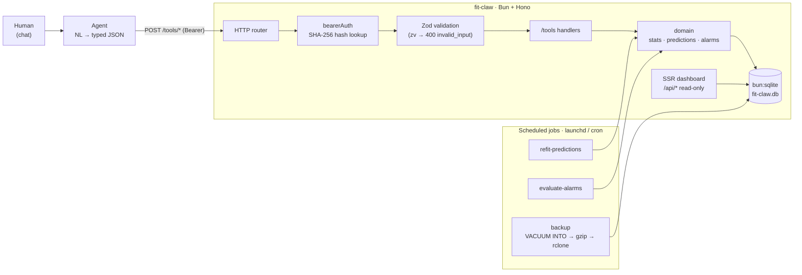
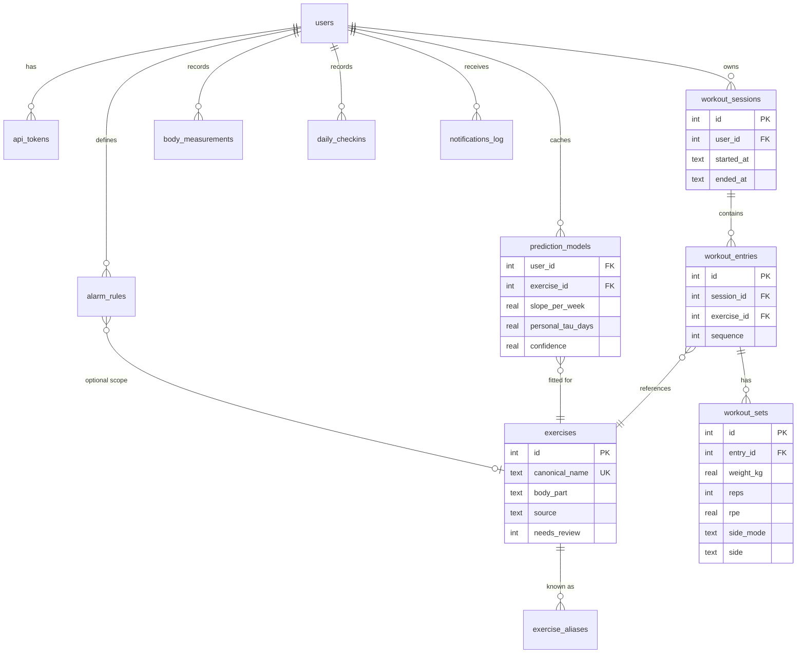

# Architecture & Design Notes

The [README](../README.md) covers *how to run* fit-claw. This document covers *why it is
shaped the way it is* — the parts that do not show up in a screenshot: the data model, the
request path, and the engineering trade-offs behind each decision.

fit-claw is a single-user-by-default, self-hosted fitness backend (Bun + Hono +
`bun:sqlite`) designed so that an LLM agent can log workouts from natural language while the
backend stays **deterministic and correctness-critical**.

---

## 1. System shape

Three entry points, one database:

- **Agents** call `POST /tools/*` with validated JSON (the write path).
- **The dashboard** reads through bearer-protected `GET /api/*` endpoints (SSR, read-only).
- **Jobs** run expensive or time-based work (prediction refit, alarm evaluation, backups)
  off the request path.

---

## 2. Request lifecycle — `POST /tools/log_workout`

A single workout log walks the full stack. Each step maps to a real file:

1. **Router** (`src/server.ts`) matches `/tools/*` and runs `bearerAuth` first.
2. **Auth** (`src/auth/bearer.ts`, `src/auth/tokens.ts`) SHA-256-hashes the incoming bearer
   token and looks up the hash in `api_tokens`. The plaintext token is never stored or
   logged. On success it puts `userId` on the request context.
3. **Validation** (`src/lib/validator.ts`) runs the Zod schema at the boundary. A bad body
   never reaches domain code — it returns `400 { error: { code: "invalid_input", message } }`
   with the offending field path.
4. **Tool handler** (`src/tools/workouts.ts`) resolves the exercise by name or alias. If it
   is unknown, it **auto-creates** the exercise (flagged `needs_review`, `source` recorded)
   instead of dropping the record, and applies unilateral defaults (e.g. `each_side`).
5. **Persistence** writes a `workout_sessions → workout_entries → workout_sets` tree under
   the authenticated `user_id`.
6. **Response** is structured JSON. Errors are normalised by a central `onError` handler
   (`src/lib/http.ts`) into `{ error: { code, message } }`; stack traces are logged with the
   `?t=` token scrubbed.

Prediction and alarm work is deliberately **not** done here — see Design Notes §4.

---

## 3. Data model

Modeling choices worth noting:

- **session → entry → set** is a three-level hierarchy, not a flat "log row". A *session* is
  one gym visit, an *entry* is one exercise within it, a *set* is one working set. This makes
  per-exercise and per-session aggregates (1RM, volume, frequency) natural SQL, and matches
  how the data is actually produced.
- **Exercises are normalised with aliases.** `exercise_aliases` (`COLLATE NOCASE`) lets the
  agent send "덤벨 로우" / "dumbbell row" / "db row" and resolve to one canonical exercise.
- **Provenance is first-class.** `exercises.source` (`seed | external | auto_created | manual`)
  and `needs_review` mean an auto-created exercise can be audited and merged later instead of
  silently polluting the catalog.
- **Single-user today, multi-user-shaped.** Every owned row carries `user_id` with
  `ON DELETE CASCADE`; the default owner is seeded as `id = 1`. Adding users later needs no
  schema rewrite.
- **Indexes follow the read patterns**: `(user_id, started_at)` on sessions,
  `(user_id, measured_at)` on body measurements, `(session_id)` / `(entry_id)` on the
  workout tree — the exact keys the dashboard and stats queries filter on.

---

## 4. Design notes

Each note is **Decision → Why → Trade-off**.

### LLM kept entirely out of the data path
**Decision:** the agent turns language into typed JSON; fit-claw never calls an LLM to
decide what to store. **Why:** data correctness must be deterministic, testable, and
reproducible — a nondeterministic model in the write path makes every bug unrepeatable.
**Trade-off:** the agent (not the backend) owns parsing quality, and the backend's API has
to be strict and well-shaped enough for an agent to target reliably.

### Tools as a typed contract, validated at the boundary
**Decision:** every `/tools/*` endpoint validates input with Zod via a single `zv` wrapper
that emits `400 invalid_input` with the failing field path. **Why:** the agent gets a
machine-readable, consistent error it can self-correct against; domain code can assume its
inputs are already well-formed. **Trade-off:** schemas must be maintained alongside handlers,
and strictness can reject sloppy-but-recoverable input.

### Never drop a record: auto-create unknown exercises
**Decision:** `log_workout` auto-creates an unrecognised exercise (marked `needs_review`)
rather than rejecting the log. **Why:** losing a user's workout because of a naming mismatch
is the worst outcome for a logging tool. **Trade-off:** the catalog can accumulate
near-duplicates, which is why provenance + a review flag exist to clean up later.

### Prediction is a cached model + a job, not request-time compute
**Decision:** `prediction_models` is an upserted cache (`UNIQUE(user_id, exercise_id)`);
`refit-predictions` and `evaluate-alarms` run as scheduled jobs, not as side effects of API
calls. **Why:** keeps the write path fast and deterministic, and keeps temporal logic
("has it been N days?") out of request handlers where it would be untestable and surprising.
**Trade-off:** predictions and alarms are eventually-consistent — fresh after the next job
run, not the instant new data lands.

### 1RM forecasting = linear trend × detraining decay, with a *learned* personal constant
**Decision:** `src/domain/predictions.ts` fits a per-exercise model over an 84-day window:
a linear `slope_per_week` for the trend, multiplied by an exponential detraining decay
`exp(-days_since_rest / tau)`. **`tau` (how fast strength fades during rest) is learned from
the user's own post-rest strength drops** (`tau = gap / -ln(ratio)`), and only falls back to
a body-part heuristic (large groups 21d, else 14d) when there are fewer than three samples.
A `confidence` score scales with sample size and whether `tau` was learned. **Why:** strength
both trends and decays, and detraining speed is individual — a model that learns it from
real data beats a fixed formula. **Trade-off:** more moving parts than a textbook 1RM
formula, so the model exposes its `basis` (slope, tau, sample size) in every response to stay
auditable rather than a black box.

### Migrations: an ordered, transactional ledger
**Decision:** plain SQL files in `src/db/migrations/`, applied in filename order, each wrapped
in a transaction and recorded in an `applied_migrations` table (`src/db/migrate.ts`). **Why:**
re-running on startup is idempotent, a half-applied migration rolls back atomically, and the
schema history is readable as plain SQL diffs. **Trade-off:** no down-migrations — forward-only,
which is a deliberate simplification for a single-owner deployment.

### Auth: hash at rest, show once, get the token out of the URL fast
**Decision:** bearer tokens are stored as SHA-256 hashes; the plaintext is printed exactly
once at creation. Dashboard bootstrap accepts `?t=<token>`, then immediately sets an
`HttpOnly` session cookie and `303`-redirects so the token leaves the browser URL. **Why:** a
leaked database should not leak usable tokens, and tokens should not linger in history, logs,
or referrers. **Trade-off:** SHA-256 (not bcrypt/argon2) is acceptable only because tokens are
long, high-entropy, randomly generated secrets — not human passwords.

### Backups: consistent snapshot, injection-guarded, offsite + pruned
**Decision:** `src/jobs/backup.ts` uses `VACUUM INTO` from a read-only connection to take a
consistent snapshot without locking writers, validates the output path against an allowlist
regex before shelling out, gzips it, and optionally `rclone`-copies offsite with retention
pruning. **Why:** a self-hosted box needs real backups, and shelling out to `gzip`/`rclone`
is an injection surface worth closing. **Trade-off:** depends on `gzip`/`rclone` being present
on the host; failures are surfaced (non-zero exit) rather than silently swallowed.

---

## 5. Testing & correctness

- **17 test suites** spanning domain logic (stats, predictions, alarms, workouts, body),
  integration (`server`, `web/api`, tool routes), auth (bearer, token hashing), and the DB
  layer (`migrate`, `schema`).
- Tests run against **in-memory SQLite** and require no `.env`, so the suite is hermetic and
  fast (`bun test`).
- Type safety is enforced separately with `bunx tsc --noEmit`.

The bias is to put correctness-critical logic (1RM math, decay, alarm thresholds) in pure
`domain/` functions that take a `Database` handle, so it can be unit-tested without HTTP.

---

## 6. Operations

- **Deployment:** Docker Compose (named volume for SQLite) or Bun + launchd on a Mac mini.
- **Network boundary:** dashboard and `/api/*` are meant to sit behind Tailscale; only a
  future `/import/*` ingress is intended to be public (via Cloudflare Tunnel).
- **Scheduling:** `refit-predictions`, `evaluate-alarms`, and `backup` are plain commands,
  driven by launchd/cron — no in-process scheduler to keep the server stateless and
  restart-safe.
- **Observability:** structured error envelope (`{ error: { code, message } }`), a `/healthz`
  probe, and token-scrubbed error logging.
